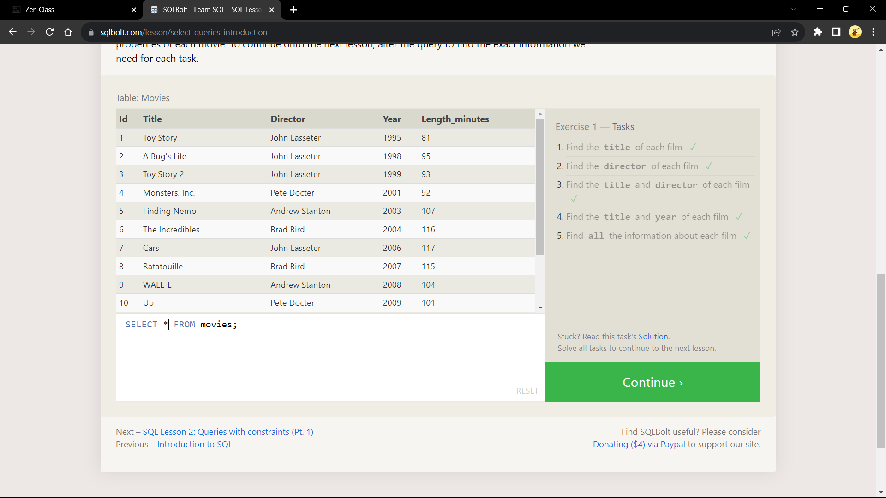
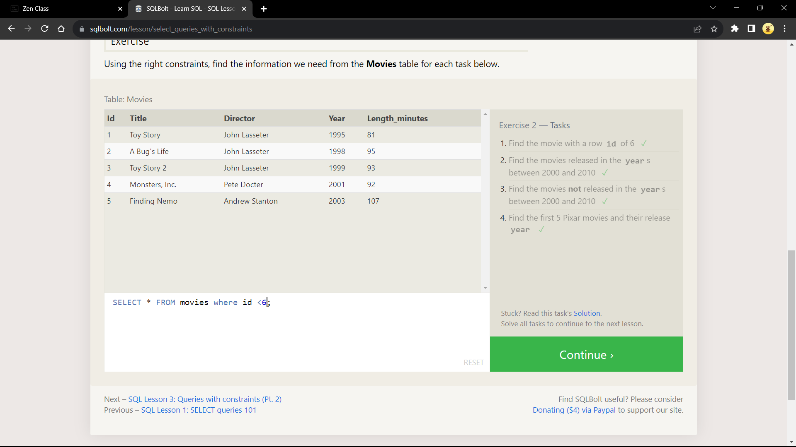
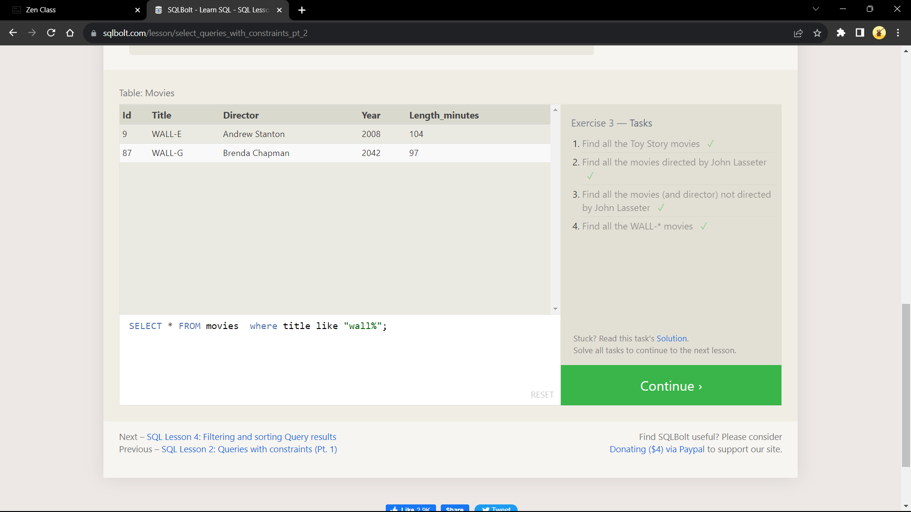
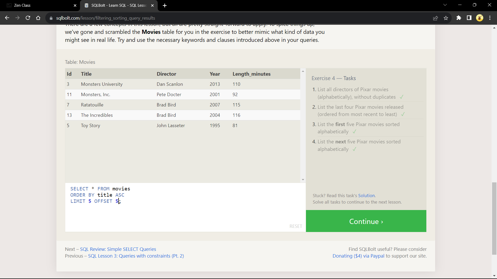
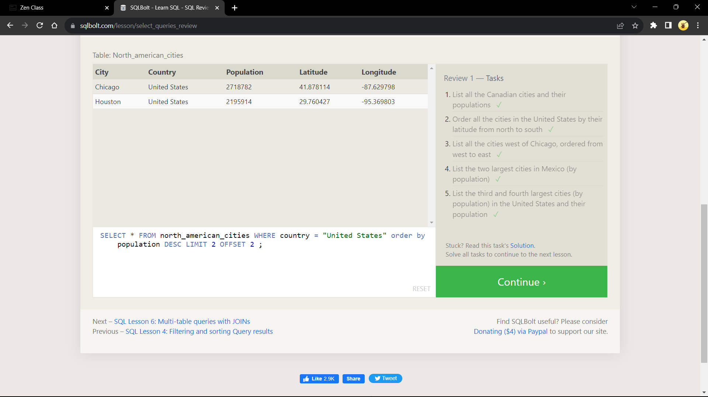
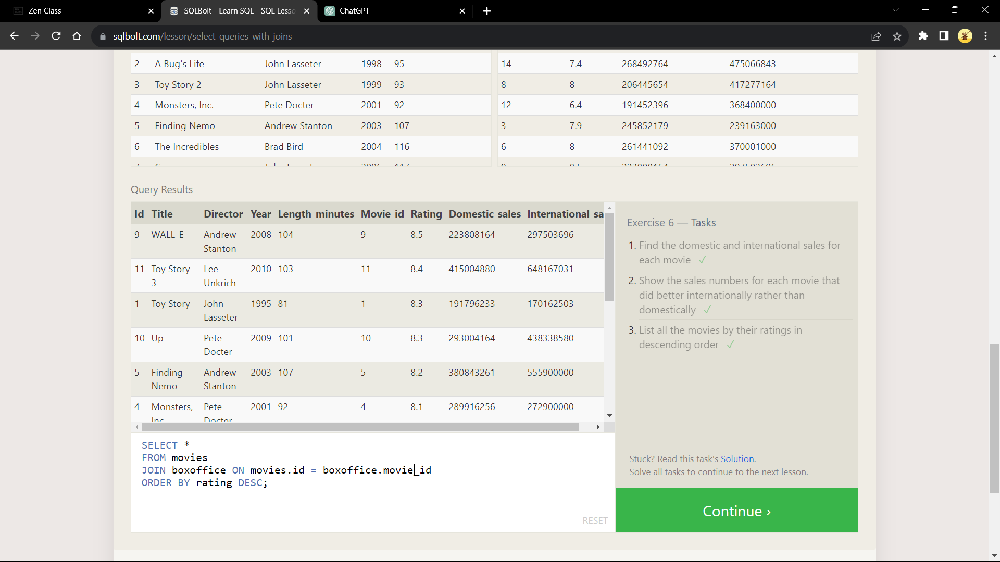
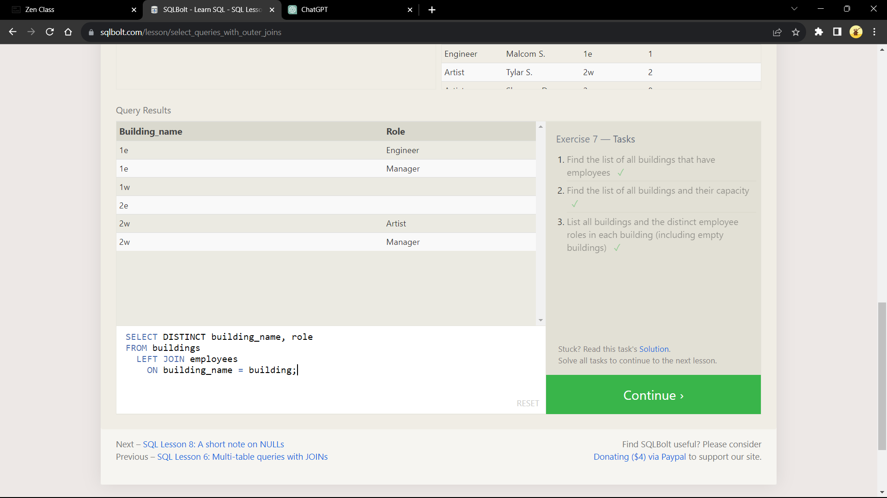
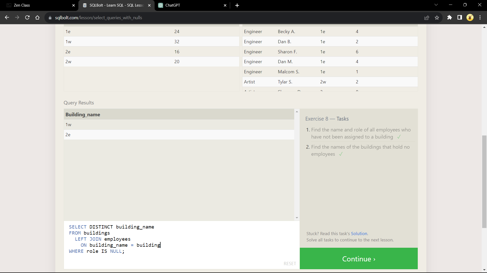

# MY SQL

This is the task for MYSQL

## SELECT queries 101

## Queries with constraints (Pt. 1)

## Queries with constraints (Pt. 2)

## Filtering and sorting Query results

## Simple SELECT Queries

## Multi-table queries with JOINs

## OUTER JOINs

## A short note on NULLs

