# MY SQL

This is the task for MYSQL

## SELECT queries 101

To retrieve data from a SQL database, we need to write SELECT statements, which are often colloquially refered to as queries. A query in itself is just a statement which declares what data we are looking for, where to find it in the database, and optionally, how to transform it before it is returned. It has a specific syntax though, which is what we are going to learn in the following exercises.

As we mentioned in the introduction, you can think of a table in SQL as a type of an entity (ie. Dogs), and each row in that table as a specific instance of that type (ie. A pug, a beagle, a different colored pug, etc). This means that the columns would then represent the common properties shared by all instances of that entity (ie. Color of fur, length of tail, etc).

And given a table of data, the most basic query we could write would be one that selects for a couple columns (properties) of the table with all the rows (instances).

Select query for a specific columns
SELECT column, another_column, …
FROM mytable;
The result of this query will be a two-dimensional set of rows and columns, effectively a copy of the table, but only with the columns that we requested.

If we want to retrieve absolutely all the columns of data from a table, we can then use the asterisk (\*) shorthand in place of listing all the column names individually.

Select query for all columns
SELECT \*
FROM mytable;
This query, in particular, is really useful because it's a simple way to inspect a table by dumping all the data at once.

Exercise
We will be using a database with data about some of Pixar's classic movies for most of our exercises. This first exercise will only involve the Movies table, and the default query below currently shows all the properties of each movie. To continue onto the next lesson, alter the query to find the exact information we need for each task

## Queries with constraints (Pt. 1)

## Queries with constraints (Pt. 2)

## Filtering and sorting Query results

## Simple SELECT Queries

## Multi-table queries with JOINs

## OUTER JOINs

## A short note on NULLs

## Queries with expressions

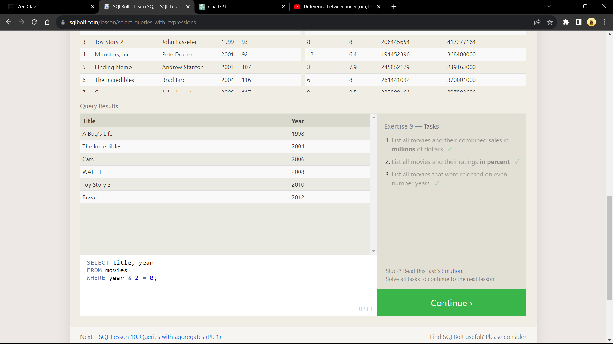

## Queries with aggregates (Pt. 1)

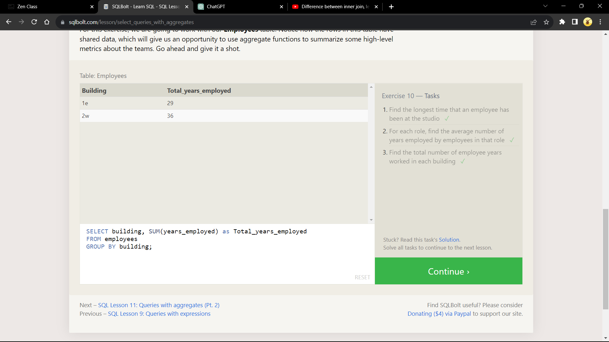

## Queries with aggregates (Pt. 2)

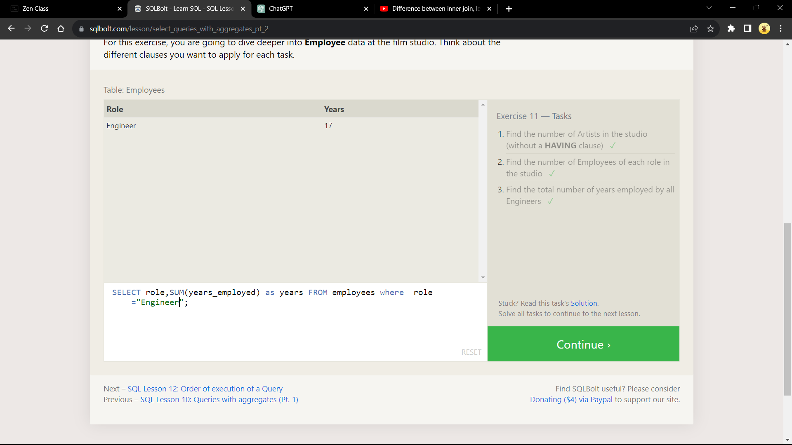

## Order of execution of a Query

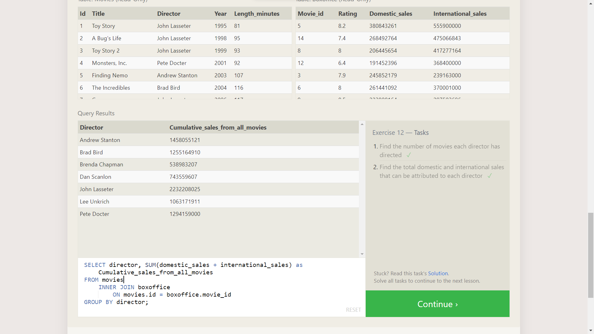

## Inserting rows

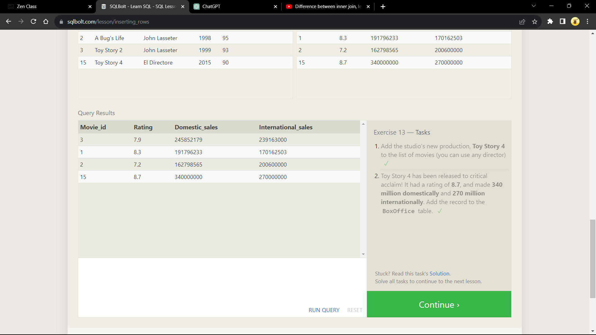

## Updating rows

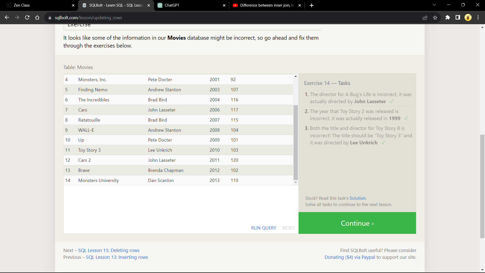

## Deleting rows

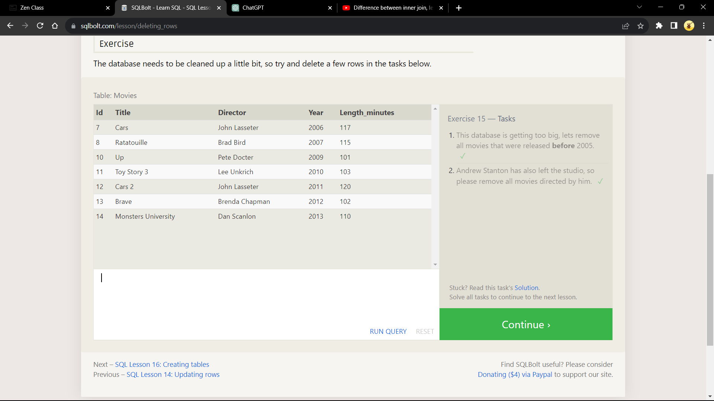

## Creating tables

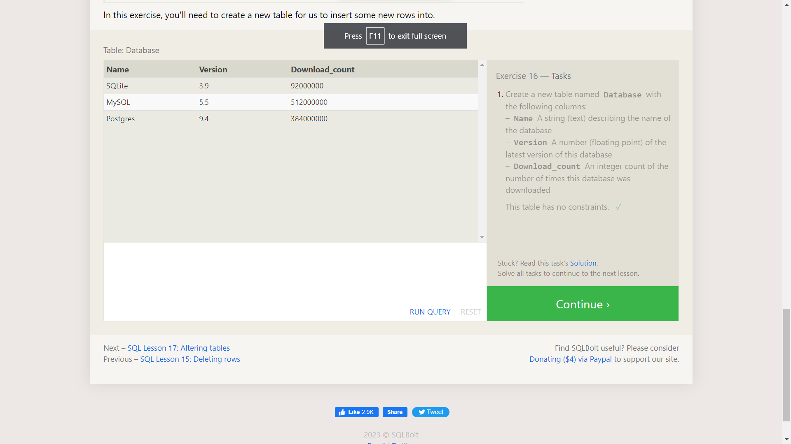

## Altering tables

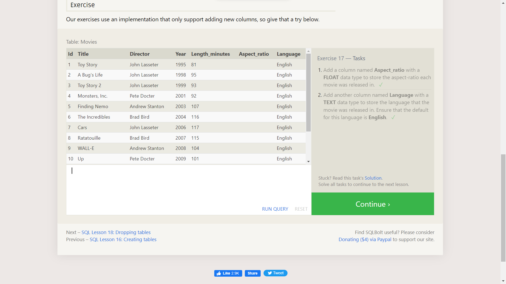

## Dropping tables

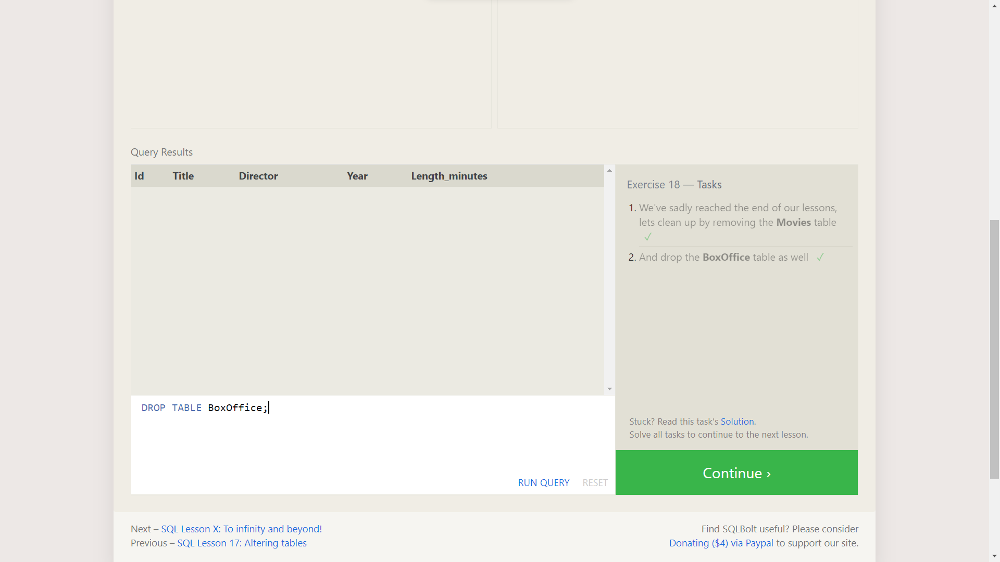

## finished the tutorial!

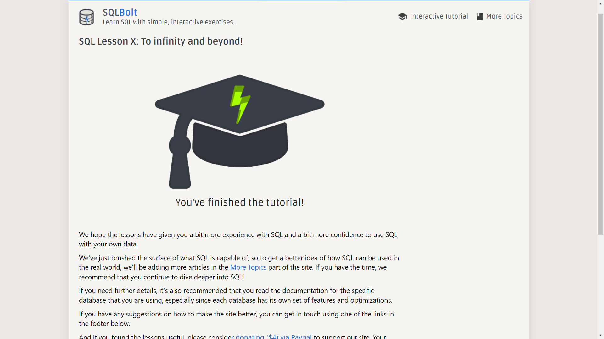
